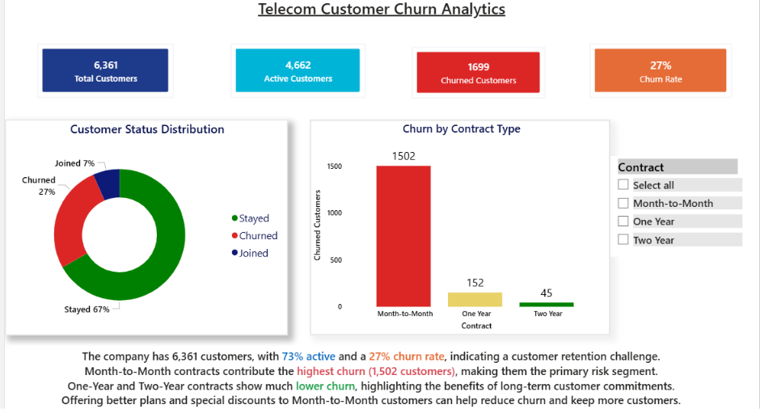

# Telecom-customer-churn-dashboard
# 📊 Telecom Customer Churn Analysis Dashboard

An interactive Power BI dashboard designed to analyze customer churn, customer behavior, contract patterns, internet service types, churn reasons, and revenue performance. The dashboard provides a business-focused view of customer retention and revenue loss to help identify key churn drivers and support data-driven retention strategies.

---

## 1. Project Title / Headline

### 📊 Telecom Customer Churn Analysis Dashboard

A dynamic and interactive Power BI dashboard built to analyze telecom customer churn, retention patterns, churn drivers, contract types, internet services, payment methods, and revenue impact.

---

## 2. Short Description / Purpose

The Telecom Customer Churn Dashboard is a multi-page Power BI report developed to help businesses understand customer churn and its impact on revenue.

The dashboard analyzes **6,361 customers** across customer status, contract type, internet service, churn reasons, payment methods, and revenue to identify high-risk customer segments and major factors contributing to customer attrition.

---

## 3. Tech Stack

The dashboard was built using the following tools and technologies:

* 📊 **Power BI Desktop** – Main data visualization and dashboard development platform.
* 📂 **Power Query** – Used for data cleaning, transformation, and preparation.
* 🧠 **DAX** – Used to create calculated measures such as total customers, churn rate, churned customers, active customers, and total revenue.
* 🗂️ **Data Modeling** – Used to organize the telecom customer data and create relationships required for analysis.
* 📈 **Data Visualization** – KPI cards, donut charts, clustered column charts, clustered bar charts, and interactive slicers.
* 📁 **File Format** – `.pbix` for Power BI development and dashboard previews/screenshots.

---

## 4. Data Source

**Source:** Telecom Customer Churn dataset.

The dataset contains customer-level telecom information including:

* Customer status
* Contract type
* Internet type
* Churn reason
* Payment method
* Revenue
* Customer demographics and service information

The dataset contains approximately **6,361 customer records**, providing sufficient information to analyze customer retention, churn behavior, and revenue impact.

---

## 5. Features / Highlights

### • Business Problem

Telecom companies face significant revenue loss when customers discontinue their services. However, simply knowing the churn rate does not explain **why customers leave, which customer segments are most affected, or which services contribute most to churn and revenue loss**.

Key business questions addressed by this dashboard include:

* What percentage of customers are churning?
* Which contract types have the highest churn?
* What are the primary reasons customers leave?
* Which internet service type has the highest churn?
* Which payment methods contribute most to revenue?
* Which internet service types generate the most revenue?
* How can businesses identify areas for customer retention?

---

### • Goal of the Dashboard

The goal was to create an interactive business intelligence solution that:

* Provides a high-level overview of customer churn.
* Identifies major customer churn drivers.
* Compares churn across contract and internet service types.
* Analyzes revenue contribution across payment and internet service categories.
* Helps businesses identify customer retention opportunities.
* Converts raw customer data into actionable business insights.

---

### • Walkthrough of Key Visuals

#### 📌 Page 1 — Executive Dashboard

The Executive page provides a high-level overview of the company's customer base and churn performance.

**Key KPIs:**

* 👥 **Total Customers:** 6,361
* 📉 **Churn Rate:** 27%
* 🚪 **Churned Customers:** 1,702
* 🟢 **Active Customers:** 4,659

**Customer Status Distribution**

A donut chart shows the distribution of customers based on their current status, allowing users to quickly compare active, churned, and other customer segments.

**Churn by Contract Type**

A clustered column chart compares churned customers across different contract types, helping identify contract segments with higher customer attrition.

**Contract Filter**

An interactive slicer allows users to filter the dashboard by contract type and analyze specific customer segments.

---

#### 📌 Page 2 — Customer Churn Analysis

This page focuses on understanding **why customers churn** and which service categories experience higher customer attrition.

**Top 10 Churn Reasons**

A bar chart ranks the most common reasons behind customer churn. Key reasons include:

* Competitors offering better offers
* Competitors providing better services
* Pricing-related issues
* Customer service issues

This helps identify areas where the business can improve its customer retention strategy.

**Customer Churn by Internet Type**

A clustered column chart compares churned customers across internet service categories.

The analysis highlights **Fiber Optic customers as a major churn segment**, making it an important area for further investigation and retention efforts.

---

#### 📌 Page 3 — Revenue Analysis

The Revenue Analysis page focuses on understanding how different customer and service categories contribute to overall revenue.

**Revenue by Payment Method**

A clustered column chart compares total revenue generated through different payment methods.

This helps businesses understand customer payment behavior and the revenue contribution associated with each payment category.

**Revenue by Internet Type**

A clustered bar chart compares revenue generated by different internet service types.

The analysis highlights **Fiber Optic as a major revenue-generating category**, while also showing the relationship between high revenue contribution and customer churn.

**Interactive Filters**

The page includes filters for:

* Contract Type
* Customer Status
* Internet Type

These filters allow users to perform more focused customer and revenue analysis.

---

### • Business Impact & Insights

**Customer Retention:**
Identifies major churn segments and the primary reasons customers leave, helping businesses develop targeted retention strategies.

**Contract Optimization:**
Highlights differences in churn across contract types and can support strategies to encourage customers toward more stable contract plans.

**Service Analysis:**
Identifies internet service categories with significant churn and revenue contribution, helping businesses investigate service quality, pricing, and customer experience.

**Revenue Protection:**
Analyzing churn alongside revenue helps businesses prioritize high-value customer segments that could result in significant revenue loss.

**Customer Experience:**
Churn reasons such as competitor offers, pricing, service quality, and customer support provide actionable areas for improving customer satisfaction.

---

## 6. Screenshots / Demos

The dashboard consists of three interactive Power BI pages:

### 📊 Executive Dashboard

Provides an overview of total customers, churn rate, active customers, churned customers, customer status, and contract-level churn.

### 📉 Customer Churn Analysis

Focuses on the major reasons customers churn and compares churn across different internet service types.

### 💰 Revenue Analysis

Analyzes revenue contribution by payment method and internet service type with interactive customer and service filters.

### Dashboard Preview

Add your Power BI dashboard screenshots here:

### Executive Dashboard


### Customer Churn Analysis


### Revenue Analysis


---

## 📌 Key Project Outcomes

* Analyzed **6,361 telecom customers**.
* Identified an overall **27% customer churn rate**.
* Analyzed **1,702 churned customers**.
* Compared churn across contract types.
* Identified the **Top 10 churn reasons**.
* Analyzed churn across internet service categories.
* Compared revenue across payment methods.
* Identified **Fiber Optic** as a major churn and revenue segment.
* Built an interactive **3-page Power BI dashboard** for business-focused customer and revenue analysis.

---

## 🛠️ Skills Demonstrated

**Power BI | Power Query | DAX | Data Cleaning | Data Modeling | Data Visualization | KPI Analysis | Customer Churn Analysis | Revenue Analysis | Business Intelligence | Business Problem Solving**

```


```
